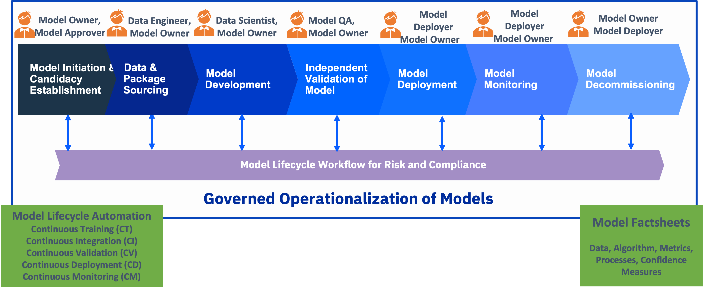
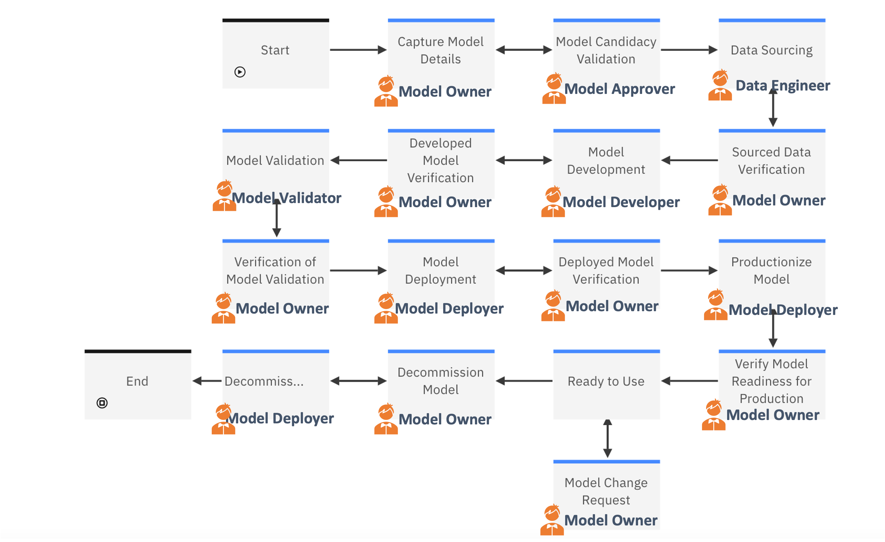
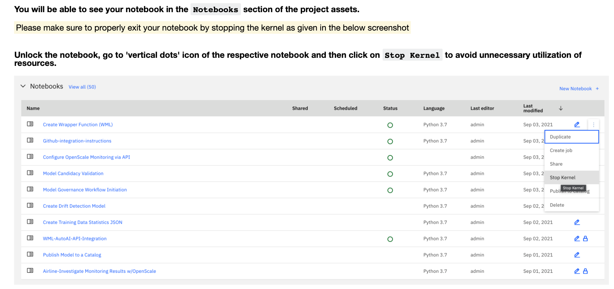

# Governed ML Operationalization Lab

Governed operationalization of AI models is a framework that uses process, people, and technology that helps in ensuring the trustworthiness of AI solutions used for business. The approach uses data and AI technologies that are integrated with an open and diverse ecosystem and is rooted in principles of trustworthy AI ethics. Governed operationalization of AI models encompasses the entire lifecycle of ML Models, starting from inception to decommission. The diagram below captures the process and people aspects of the same.



For more detailed on Governed operationalization of AI models please refer to https://opendatascience.com/trustworthy-ai-operationalizing-ai-models-with-governance-part-1/.

The Lab in this github repository takes you through End-to-End Governed ML Operationalization for a given use case in Heterogeneous platforms. In this Lab, we will be demonstrating the end to end pipeline creation using Airline Delay Dataset. The stages of the Governed ML Ops those are covered in this lab include:

1. Model Governance Workflow Initiation
2. Model Candidacy Validation
3. Data Acquistion
4. Model Development
5. Model Validation
6. Model Deployment
7. Model Productionization and
8. Model Monitoring

---

### Step by Step Lab Instructions<a class="anchor" id="Lab-Instructions">: 
  
#### Hello, folks! 

#### Use Case
Flight delay has become a very important subject for air transportation all over the world because of the associated financial losses that the aviation industry incurs. According to data from the Bureau of Transportation Statistics (BTS) of the United States, over 20% of US flights were delayed during 2018, which resulted in a severe economic impact equivalent to 41 billion US$.

These delays not only cause inconveniences to the airlines but also to the passengers. The result is an increase in travel time which increases the expenses associated with food and lodging and ultimately causes stress among passengers. The airlines are victims of extra costs associated to their crews, aircraft repositioning, fuel consumption while trying to reduce elapse times, and many others which together tamper their reputation and often result in a loss of demand by passengers.

The reasons for these delays vary from air congestion to weather conditions, mechanical problems, difficulties while boarding passengers, and simply the airlines inability to handle the demand given its capacity.
In this course, we showcase the machine learning operationalization (MLOps) workflow applied to a model which predicts flight delays. 

---

### Dataset Information

- There are 2 datasets we will be using for this lab.   
  - The `first dataset` contains flight information (FLIGHT_ID, MONTH, DAY, DAY_OF_THE_WEEK, DEPARTURE_DELAY TAXI_OUT, DISTANCE, DELAYED, YEAR).
    - DELAYED Field is the target variable to be predicted. 
  - The `second dataset` contains flight destination information (FLIGHT_ID, ORIGIN_AIRPORT, DESTINATION_AIRPORT). 

- Each group will get different versions of the above dataset with same number of attributes/columns but different value of the data.
---

<br>

<br>
### Details of Governed MLOps flow

In this Lab, you will run through the following modules in order to execute Governed MlOps flow. The various phases and the steps of Goverened ModelOps flow are depicted in the diagram below.





The notebooks in the various section of this ReadMe contain instructions for executing the steps in the Governed MLOps flow. 

<br>
<br>

The following spreadsheet contains the information for each group pertaining to their respective projects and resources: [Groups-Information](./University_Course_Spreadsheet.xlsx)
 
 <br>

### Model Governance Workflow Initiation<a class="anchor" id="Model-Governance-Workflow-Initiation">

1. This module covers Governance Workflow Initiation in <i>IBM OpenPages with Watson</i>. The Workflow feature of IBM Openpages is used for Model Governance Lifecycle for Risk and Compliance.
<br>
  
   <i> Role </i>: This step needs to be executed by `ModelOwner`

   - Instructions are provided in the notebook: [Model Governance Workflow Initiation](./Model_Governance_Candidacy/Model%20Governance%20Workflow%20Initiation.ipynb)  
   - After executing the instructions, you would have entered a unique model name in OpenPages. Please note the Model name which will be used for rest of the lab. Also, the Model Workflow will be assigned to `ModelApprover` for Model Candidacy Validation.


<br>

---------

### Model Candidacy Validation<a class="anchor" id="Model-Candidacy-Validation">

2. This module of the workflow captures the Model details as part of Model Governance Workflow using IBM Openpages. 
<br>
   
   <i> Role </i>: This step needs to be executed by `ModelApprover`. 

   - Log into OpenPages as ModelApprover. From the task list, select the model corresponding to the unique model name as obtained in the previous module.
   - Instructions are provided in the notebook: [Model Candidacy Validation](./Model_Governance_Candidacy/Model%20Candidacy%20Validation.ipynb)
   - After this step, the Model Workflow would be assigned to `ModelDataEngineer` for Data Acquisition.

<br>

---------

### Data Sourcing/Data Acquisition<a class="anchor" id="Data-Acquisition">

3.a This module provides the steps where a data engineer can source the data needed to develop a model. 
<br>

   <i> Role </i>: This step needs to be executed by `ModelDataEngineer`. 

   - Log into OpenPages as ModelDataEngineer. From the task list, select the model corresponding to the unique model name as obtained from `Model Governance Initiation` Module.
   - Review the necessary information (Model Details, Model Catalog, Details about Data Source etc.) needed for data sourcing. This is for Reviewing or Information purposes only. No action needs to be taken in Openpages yet. 


3.b In this sub-step, we create a joined virtualized view of the raw dataset by navigating back to home page URL of the Cloud Pak For Data. The Virtualized Dataset will then be added to your respective catalog and profiled. 

```
Note: The datasets are pre-loaded in DB2 and Postgres. 
   - Naming convention:
     - <MONTH>_FLIGHT_INFORMATION for DB2
     - <month>_airport_information for postgres
   - We will do some feature engineering and join the datasets using Data Virtualization in the notebook below. 
```
   - Instructions are provided in the notebook: [Data Acquistion](./Data_Virtualization/Data%20Virtualization%20(Postgres%20%2B%20DB2).ipynb)
   
<br>
3.c In this sub-step, the relevant information about data sourcing is updated in model workflow.
<br>
   <i> Role </i>: This step needs to be executed by `ModelDataEngineer`

   - 3.c.1. Log into Openpages as ModelDataEngineer, navigate to the tasks section and click on your model name obtained from Model Governance Initiation module.

   - 3.c.2. Click on Data Sourcing view, fill out the necessary fields (Training Data Asset Name, Training Data Quality Flag (indicating whether the training data quality is acceptable or not)). 
      - Training Data Asset Name: Provide the name of the virtualized data set that you created using Data Virtualization and added to the catalog.
      - Training Data Quality Flag: Update the Training Data Quality flag as `true` if, after data profiling you find that the data doesn't have any null values and the attributes are not skewed etc. 

   - 3.c.3. Then, click on Save. Next, click on `Data Acquisition Verified` by navigating to actions on top right. This will move the model to `Data Acquisition Completed` stage.
 
<br>

3.d. In this sub-step, the model owner needs to take the appropriate action in order to make the model ready for development.
<br>

   <i> Role </i>: This step needs to be executed by `ModelOwner`.

   - 3.d.1. Log into Openpages as ModelOwner, navigate to the tasks section and click on the model name obtained from Model Governance Initiation module.
   - 3.d.2. Model Owner verifies the training data quality flag and the training data set by getting the name from OpenPages and investigating the data asset in the respetive catalog by navigating to home page URL of Cloud Pak For Data.
   - 3.d.3. The Model Owner then updates the `Model Life Cycle Stage` to `Approved for Development` and clicks on Save. Then, Model owner clicks on actions on top right to `Model Development` indicating the model is Ready for development stage. This will move the model to `Approved for Development` stage.

<br>

---------

### Model Development<a class="anchor" id="Model-Development">

4.a. This module provides the steps where a data scientist will develop a model. In Model Development step, the developer or data scientist will be creating the `development` project. 

<br>

   <i> Role </i>: This step needs to be executed by `ModelDeveloper`. 

   - Log into OpenPages as ModelDeveloper. From the task list, select the model corresponding to the unique model name as obtained from `Model Governance Initiation` Module.
   - Review the necessary information (Model Details, Model Catalog, Details about Data Source like Training Data and Data Quality etc.). 

<br>

4.b. Inspect the respective Project located in Cloud Pak For Data to be used for Model Development.
  - Each User will create a new Development project `Airline-MLOps-Dev-User-Name` where User-name is allocated to you (eg. Airline-MLOps-Development-Cluster1-User10). You will use this project on Cloud Pak for Data to be used during model development phase. Go to "Cloud Pak for Data" Home Page, login with your credentials.  
  - After logging in, click on `Hamburger` icon on the top left, scroll down to projects tab and click on All Projects. Then, click on new project, provide your project name and import the `dev` zip file provided to you at the time of project creation.

<br>

4.c. This step involves adding the virtualized dataset to your respective project. 
   - Instructions are provided in the notebook: [Data Catalog to Project](./Data_Catalog_Project/Loading%20Data%20from%20WKC%20to%20Project.ipynb)
  
<br>


4.d. This step converts the Training Dataset that you added to the project to csv file which will eventually be used for Model Development. 
   - Instructions are provided in the `Feature Transformation` notebook named `Virtualization Data Format Conversion` pre-loaded in your development project after importing the zip file. 
   - This step is typically needed for some additional feature engineering during the model development phase. In this lab, we are not doing any additional feature engineering for simplicity.

`Note: After Running any particular notebook, make sure to stop the kernel in order to avoid slowing down the cluster as shown in the image below. Repeat this for every notebook after running it in Cloud Pak for Data platform`



<br>

4.e. Model Development - In this sub-step, we will execute approaches for Model development using IBM Environment on Cloud Pak For Data:

   - 4.e.1 Model Development using UI based approach:
      - 4.e.1.1. Instructions for performing Model Development using UI Based approach (AutoAI) : [Model Development Using AutoAI](./Model_Development/Model_Development_AutoAI/Model_Development_AutoAI.ipynb)
      - 4.e.1.2. This sub-step involves accessing and saving the performance metrics and details of various experiments using AutoAI (in the form of excel file). Instructions are provided in the notebook named as `WML-AutoAI-API-Integration` pre-loaded in your development project. 
      - 4.e.1.3. Store the model to the catalog - [Publish Model to Catalog](./Model_Development/Model_Store/Publish%20Model%20to%20a%20Catalog.ipynb) 
      - 4.e.1.4. Next, store the Model Experiment csv/excel file to the catalog you created in 4.e.1.2. On the Data Assets section, click on the 3 dots next to the file, and select publish to your respective catalog from the drop down.


   - 4.e.2 Model Development using code based approach:
      - 4.e.2.1. Instructions for performing Model Development using code based approach (Scikitlearn model) are provided in the notebook named `Airline Model Development using Scikit-Learn` provided in the development project.
      - 4.e.2.2. Store the model to the catalog - [Publish Model to Catalog](./Model_Development/Model_Store)
      - 4.e.2.3. Next, store the Model Experiment csv file you created using 4.e.2.1 into the catalog (similar to the step executed for AutoAI model in 4.e.1 step). On the Data Assets section, click on the 3 dots next to the file, and select publish to your respective catalog from the drop down.
      
<br>

4.f. Create and Store Necessary Artifacts for Model Validation/Monitoring in IBM Platform:
<br>

`Note: You must provide Watson OpenScale access to training data. Watson OpenScale needs access to your training data in order to generate contrastive explanations, display training data statistics and to create and calibrate drift detection. The Drift monitor uses training data to create and calibrate drift detection.`


   - 4.f.1. In this sub-step, you need to create the training Data Statistics JSON to the project and Publish to the Catalog. 
      - Instructions are provided in the notebook named `Create training data Statistics JSON` pre-loaded in your development project. 
      - After executing the notebook, publish the `training_stats.json` that was stored in the project, into your respective model catalog. 


   - 4.f.2. In this sub-step, you would be provided with a drift detection model file that would be pre-loaded in the respective development project. 
      -  Next, publish the `Drift_Model.tar.gz` file that was stored your development project, into your respective model catalog, similar to how you pushed model/training data statstics file to the catalog previously. 


4.g In this sub-step, the relevant information about Model Development is updated in model workflow.
  <br> 
  
   <i> Role </i>: This step needs to be executed by `ModelDeveloper`

   - 4.g.1. Log into Openpages as ModelDeveloper, navigate to the tasks section and click on the model name obtained from Model Governance Initiation module.
   
   - 4.g.2. Click on `Model Development` view, fill out the necessary/key fields:
      - Model Asset name: Enter the name of the Model Asset that you used to save the model in 4.e step.
      - Development System Name: Enter `IBM Platform` in the text field. For other platforms, you should provide the details appropriately.
      - Training Data Statistics File: Update the name of the Training Data Statistics File that you created in 4.f.1 step.
      - Drift Detection Model File: Update the name of Drift Detection Model File that you have from 4.f.2 step stored in the catalog.
      - Model Experiment FileName: Update the name of the model experiment file (csv/excel file) that you created in 4.e.1.2. (for AutoAI, similar step can be executed for Scikit learn model) step that was pushed to the catalog
      - Model Quality: Update the overall performance metric of the model. In our case, you can use Accuracy. It can be Accuracy, Precision, F1-Score etc. as appropriate based on the use case. Model Quality field has to be an integer. (Go back to AutoAI and look at the accuracy result of the model in the pipeline which you saved in the project) 
      
   - 4.g.3. Then, click on Save. Next, click on `Model Development Verified` by navigating to actions on top right. This will move the model to `Model Development Completed` stage.
 
4.h. In this sub-step, the model owner needs to take the appropriate action in order to make the model ready for validation.
  <br>
  
   <i> Role </i> This step needs to be executed by `ModelOwner`

   - 4.h.1. Log into Openpages as ModelOwner, navigate to the tasks section and click on the model name obtained from Model Governance Initiation module.
   
   - 4.h.2. Model Owner verifies the Model development details (Model Experiment File, Model Quality, Training Data Statistics File and Drift Detection Model file) by investigating the corresponding assets in the catalog.
   
   - 4.h.3. The Model Owner then updates the `Model Life Cycle Stage` from `Model Development Completed` to `Approved for Validation` and clicks on Save. Then, Model Owner navigates to `Model Validation` view and updated the `Have you moved the model from Dev to test` to `Yes`. Then, Model owner clicks on actions on top right to `Model Validation` indicating the model is Ready for Validation stage. This will move the model to `Approved for Validation` stage.

<br>

---------

### Model Validation<a class="anchor" id="Model-Validation">


5.a. This module provides the steps where a Model Validator will perform independent validation of the model. The Model Validator will have access to the Production (or Validation, used interchangeably) project, catalog and UAT/Pre-prod Deployment Space. 

<br>
  <i> Role </i>: This step needs to be executed by `ModelValidator`. 

   - Log into OpenPages as Model Validator. From the task list, select the model corresponding to the Model name as obtained from `Model Governance Initiation` Module.
   
   - Review the necessary information (Model Details, Model Catalog, Model Development Details including Data Quality, Training Data Statistics File and Drift Statistics file). 


5.b Model Validation:

`Note: Developer has pushed the developed model to the catalog. Validator doesn’t have access to development project. Validator has to get the model from the catalog and push the model to the validation/production project. `

   - 5.b.1. In this sub-step, `CREATE` a new validation/production project named `Airline_MLOps_Prod_User-name` in IBM Cloud Pak for Data by importing the zip file provided by the instructor. The validator then pushes the model to the validation/production project. 
     - Instructions are provided in the notebook: [Pushing Model to Validation Project](./Data_Catalog_Project/Model%20from%20Catalog%20to%20Project.ipynb)
  
   - 5.b.2. In this sub-step, the validator is staging the model to UAT/Pre-prod deployment space. 
     - Instructions are provided in the notebook: [Staging the Model in UAT/Pre-prod Deployment Space](./Model_Validation/UAT_Model_Deployment.ipynb)
     
   - 5.b.3. In this sub-step, the validator smoke-tests the Model using Rest API. 
     - Instructions are provided in the notebook named `Getting Prediction from Model using REST` is pre-loaded in the validation project. 

   - 5.b.4. Configuring Model in OpenScale for Independent Validation:    
     - 5.b.4.1. In this sub-step, we configure the model in Watson Openscale.
        - Instructions are provided in the notebook: [Configuring Model in OpenScale](./Model_Validation/Configuring%20Model%20in%20OpenScale.ipynb)

     - 5.b.4.2. In this sub-step, we configure the model monitors  in Watson Openscale.
        - Instructions are provided in the notebook: [Model Monitors configuration in Openscale](./Model_Validation/Config%20of%20Model%20Monitors%20in%20OpenScale.ipynb) 

     - 5.b.4.3. In this sub-step, we evaluate the model in the staging area. 
        - Instructions are provided in the notebook: [Pre-prod Model Evaluation and Model Approval](./Model_Validation/Pre-Prod%20Model%20Eval%20%26%20Model%20Approval.ipynb)
  
  <br>

5.c. In this sub-step, the summary information (all the detailed information is already updated in the previous step) about Model Validation is updated in model workflow.
  <br>
  
    <i> Role </i>: This step needs to be executed by `ModelValidator`.

   - 5.c.1. Log into Openpages as ModelValidator, navigate to the tasks section and click on the model name obtained from Model Governance Initiation module.
   
   - 5.c.2. Click on `Model Validation` view, fill out the necessary/key fields (Model Validation Report, Validation Dataset). 
     - Model Validation Report: Enter the Validation report file that was uploaded from Openscale to Openpages. In order to get the name of the report file that was sent to Openpages, navigate to `Issues and Documents` section in OpenPages Model Workflow and copy the Validation Report filename.
     - Validation Dataset: Enter the name of the Validation dataset that was used from the catalog for validation.
   
   - 5.c.3. Then, click on Save. Next, click on `Model Validation Verified` by navigating to actions on top right. This will move the model to `Model Validation Completed` stage.
 
5.d. In this sub-step, the model owner needs to take the appropriate action in order to make the model ready for deployment.
  <br>
   <i> Role </i> This step needs to be executed by `ModelOwner`

   - 5.d.1. Log into Openpages as ModelOwner, navigate to the tasks section and click on the model name obtained from Model Governance Initiation module.
   
   - 5.d.2. Model Owner verifies the Model validation details by reviewing the Model Validation Report file (by navigating to `Issues and Document` section in Openpages Model workflow) and Validation Dataset stored in the catalog.
    `Note: The Name of Model Validation report file stored in Issues and Document section in Openpages would be named different from what you saved from Openscale. Make sure you use the name fetched from Openpages.`
   
   - 5.d.3. The Model Owner then updates the `Model Life Cycle Stage` from `Model Validation Completed` to `Approved for Deployment` and clicks on Save. Then, Model owner clicks on actions on top right to `Model Deployment` indicating the model is Ready for Deployment stage. This will move the model to `Approved for Deployment` stage.

<br>

---------

### Model Deployment<a class="anchor" id="Model-Deployment">

##### Model Deployment in IBM Environment

6.a. This module provides the steps where a Model Deployer will perform independent validation of the model.
<br> <i> Role </i>: This step needs to be executed by `ModelDeployer`. 

   - Log into OpenPages as Model Deployer. From the task list, select the model corresponding to the Model name as obtained from `Model Governance Initiation` Module.
   
   - Review the necessary information (Model Development Details, Model Catalog, Model Validation details). 
   
   
`Note: There are 2 approaches for pushing model from pre-prod to production environment. In this step, we will follow the following approaches to push the model created in IBM environment into Production. `

6.b. Model Deployment in Production Environment:

   - 6.b.1. In this sub-step, we are pushing the model in production using using CI/CD approach.
      - Follow the instructions in the notebook: [Notebook_Instructions](./CICD/Push%20Model%20from%20Pre-Prod%20to%20Prod%20(CICD)%20Instructions.ipynb)
      - This consists of CICD approach for Model Deployment from Pre-prod to Production Environment using Code-based approach.
     

   - 6.b.2. In this sub-step, we are pushing AutoAI model in Production using UI based Approach.
      - Instructions are provided in the notebook: [Model Deployment and Configuration for Monitoring](./Model_Deployment_Monitoring_Configuration_Production/Model%20Deployment%20%26%20Config%20for%20Monitoring.ipynb)
  
 
 6.c. In this sub-step, the summary information (all the detailed information is already updated in the previous step) about Model Deployment is updated in model workflow.
  <br>
    <i> Role </i>: This step needs to be executed by `ModelDeployer`
    
   - 6.c.1. Log into Openpages as ModelDeployer, navigate to the tasks section and click on the model name obtained from Model Governance Initiation module.
   
   - 6.c.2. Click on `Model Deployment` view, fill out the necessary/key fields. 
      - Endpoint: Enter the Endpoint URL that you can retreieve from WML deployment.
      - Model Deployment Space: Enter the model deployment space of the production environment where the model was deployment.
      - Deployment Platform: Enter the deployment platform as WML from the drop down menu.
   
   - 6.c.3. Then, click on Save. Next, click on `Model Deployment Verified` by navigating to actions on top right. This will move the model to `Model Deployment Completed` stage.
 
6.d. In this sub-step, the model owner needs to take the appropriate action in order to make the model ready for deployment.
  <br>
   <i> Role </i> This step needs to be executed by `ModelOwner`

   - 6.d.1. Log into Openpages as ModelOwner, navigate to the tasks section and click on the model name obtained from Model Governance Initiation module.
   
   - 6.d.2. Model Owner verifies the Model Deployment details by reviewing the Model Deployment endpoint.
   
   - 6.d.3. The Model Owner then updates the `Model Life Cycle Stage` from `Model Deployment Completed` to `Approved for Productionization`. Model Owner also updates the field : `Have u moved the model from test to production infrastructure` as YES and then clicks on Save. Then, Model owner clicks on actions on top right to `Productionize Model` indicating the model is Ready for Productionization. This will move the model to `Approved for Productionization` stage.

---------
<br>

### Model Productionization<a class="anchor" id="Model-Productionization">


7.a. This module provides the steps where a Model Monitor will perform configuration for Productionization of the model.
<br>
  <i> Role </i>: This step needs to be executed by `ModelMonitor`. 

   - Log into OpenPages as Model Monitor. From the task list, select the model corresponding to the Model name as obtained from `Model Governance Initiation` Module.
   - Review the necessary information (Model Development Details, Model Catalog, Model Validation details and Model Deployment Details). 
   
7.b. Configure Models in Production Environment:

   - 7.b.1. In this sub-step, we create WML Model Wrapper Function in Production Environment. 
      - Instructions are provided in the notebook : [WML Model Wrapper Function](./Model_Deployment_Monitoring_Configuration_Production/Create%20Wrapper%20Function%20Instructions%20(WML).ipynb)


   - 7.b.2. In this sub-step, we configure model for monitoring in production. 
      - Instructions are provided in the notebook: [Openscale Configuration via API](./Model_Deployment_Monitoring_Configuration_Production/Configure%20OpenScale%20via%20API%20Instructions.ipynb)
      
7.c. In this sub-step, the summary information (all the detailed information is already updated in the previous step) about Model Productionization is updated in model workflow.
  <br>
    <i> Role </i>: This step needs to be executed by `ModelMonitor`

   - 7.c.1. Log into Openpages as Model Monitor, navigate to the tasks section and click on the model name obtained from Model Governance Initiation module.
   
   - 7.c.2. Click on `Model Deployment` view, fill out the necessary/key fields. 
      - Wrapper Function Endpoint: Enter the Endpoint URL that you can retreieve from production deployment space.
      - Wrapper Function Name: Enter the wrapper function name you retrieve from production deployment space.
      - Model Monitoring URL: Enter the model monitoring subscription URL (which is the browser URL of the monitoring tile for the wrapper function in Openscale).
   
   - 7.c.3. Then, click on Save. Next, click on `Verify Model Readiness for Production` by navigating to actions on top right. This will move the model to `Pre Production Review` stage.

 

7.d. In this sub-step, the model owner needs to take the appropriate action in order to make the model ready for production use.
  <br>
   <i> Role </i> This step needs to be executed by `ModelOwner`

   - 7.d.1. Log into Openpages as ModelOwner, navigate to the tasks section and click on the model name obtained from Model Governance Initiation module.
   
   - 7.d.2. Model Owner verifies the Model Readiness details in Openpages.
   
   - 7.d.3. The Model Owner then updates the `Model Life Cycle Stage` from `Pre Production Review` to `Ready to Use` and clicks on Save. Then, Model owner clicks on actions on top right to `Ready to Use` indicating the model is Ready for use. 


---------
<br>

### Model Monitoring in Production Environment<a class="anchor" id="Model-Monitoring">

`Run the notebooks below in sequence for developed Model which have been pushed to production. 

   - 8.a. Instructions are provided in the notebook named `Sending Mult. Scoring Req. to Deployment` pre-loaded in your validation/production project. 
   
   - 8.b. [Model Monitoring in Production Environment](./Model_Monitoring_Production/2.%20Model%20Monitoring%20in%20Production%20Env..ipynb)
   
   - 8.c. [Investigate Monitoring Results using Watson OpenScale](./Model_Monitoring_Production/3.%20Investigate%20Monitoring%20Results%20w_OpenScale.ipynb)
   
   - 8.d. Check usability status in OpenPages - Usability Status in Openpages should change to `red` after few minutes. 
   
   `Note: The usability status in Openpages is dependent on values received from Openscale. The value of usability status changes from Accept to Reject if any of the model monitoring metrics are below the threshold and appear as red. `
   
  - 8.e. Test model again with new scoring request from the UI as you performed during smoke-testing in the validation phase. This time, there would be error response indicating that model execution is not allowed.

---------
<br>

### Governed Operationalization of Model developed and deployed in Non-IBM Environment:

#### REPEAT STEPS 1-3 from above involving Data Sourcing and Virtualization, following the same sequence. 

#### Model Development outside IBM Environment:

  - 4.a. Model Development outside IBM environment(3rd party Environment) - Instructions are provided in the notebook named `Airline Model development Heroku` pre-loaded in the development project. 
     - `Note: In case you want to skip this step, the model pkl file will be provided to you through your respective catalog. Simply push the model file from the catalog to your project.`
  - 4.b. Store the model to the catalog in `Model Store` - [Publish Model to Catalog](./Model_Development/Model_Store) - This will store the respective model to the catalog.

<br>
      
      
  - 4.c. Reuse the following Artifacts for Model Validation/Monitoring that were created in IBM Platform as highlighted below: 
    - 4.c.1 Instructions are provided in the notebook named `Create training data Statistics JSON` pre-loaded in your development project. 
       
    - 4.c.2. Instructions are provided in the notebook named `Create Drift Detection Model` pre-loaded in your development project.
    
---------

### Model Validation

5. In this lab, we will be skipping Model Validation step due to limited time.

---------
### Model Deployment

  #### Model Deployment using Heroku Platform:
6. In this step, we deploy the developed model using Heroku Platform(3rd party Environment). Instructions are provided in the notebook named `Deploy model to Heroku` pre-loaded in your validation/production project. 
  
---------

### Model Productionization:

7. Configure Models in Production Environment:
  - 7.a. Model Wrapper Function and Deployment in Production Environment.   [Model Wrapper Function in Heroku Instructions](./Model_Deployment_Monitoring_Configuration_Production/Create%20Wrapper%20Function%20Instructions%20(Heroku).ipynb)
 
  - 7.b. In this sub-step, we configure model for monitoring in production. 
     - Instructions are provided in the notebook named `Configure Openscale via API Instructions`pre-loaded in your validation/production project. 

---------


### Model Monitoring in Production Environment:
`Run the notebooks below in sequence for the Model which have been pushed to production.`

  - 8.a. Sending Scoring requests in Production Environment: 
    - 8.a.1. Instructions are provided in the notebook named `Send Scoring Requests from Virtualized Data` pre-loaded in your validation/production project. 
    
    - 8.a.2. (Optional) Instructions are provided in the notebook named `Sending Mult. Scoring Req. to Deployment` pre-loaded in your validation/production project which is sending random scoring requests to the productionized model. 
   
  - 8.b. [Model Monitoring in Production Environment](./Model_Monitoring_Production/2.%20Model%20Monitoring%20in%20Production%20Env..ipynb)
   
  - 8.c. [Investigate Monitoring Results using Watson OpenScale](./Model_Monitoring_Production/3.%20Investigate%20Monitoring%20Results%20w_OpenScale.ipynb)

  - 8.d. Check usability status in OpenPages - Usability Status in Openpages should change to `red` after few minutes. 
   
`Note: The usability status in Openpages is dependent on values received from Openscale. The value of usability status changes from Accept to Reject if any of the model monitoring metrics are below the threshold and appear as red. `
   
  - 8.e. Test model again with new scoring request from the UI as you performed during smoke-testing in the validation phase. This time, there would be error response indicating that model execution is not allowed.

---------
<br>


#### OPTIONAL MODEL DEVELOPMENT STAGE

- Model Development in Opensource Environment using Kedro Pipeline - [Model Development with Kedro Pipeline](./Model_Development/Model_Development_Opensource_Kedro) 
     -  Github Integration for Kedro Pipeline: You will have to integrate your Cloud pak for Data project with Github if you intend to work with Jupyter-lab as per the following instructions:` [Github Integration](./Github_Integration/Github-integration-instructions.ipynb)
     - Store the model to the catalog in `Model Store` - [Publish Model to Catalog](./Model_Development/Model_Store) - This will store the respective model to the catalog.
     
     
UI based production env push  
  - 7.b.2. In this sub-step, Run Model Configuration in Production in Openscale:
    - 7.b.2.1. This sub-step involves configuring model to production space. Insturctions are provided in the notebook: [Configuring Model in OpenScale](./Model_Validation/Configuring%20Model%20in%20OpenScale.ipynb)
    - 7.b.2.2. [Model Monitors configuration in Openscale](./Model_Validation/Config%20of%20Model%20Monitors%20in%20OpenScale.ipynb) 
